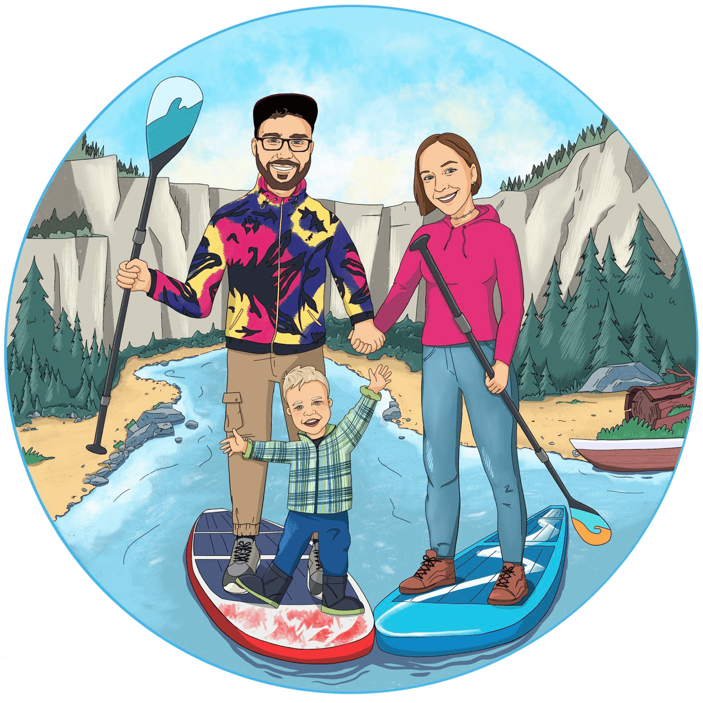

# sup-time website
## Сап прогулки в Пушкино вместе с SUP-TIME. С нами можно гулять по воде!

      

https://sup-time.ru/

 <tr>
                            <td class="day" colspan="2">Пятница</td> 
                        </tr>
                        <tr>
                            <td>8:00 - утро в Тишково 900 р/час</td>
                            <td>17:00 / 19:00 - прогулка по Уче в Пушкино без сопровождения инструктора. ( инструктаж, далее инструтор помогает с берега стартовать и вы гуляете самостоятельно по Уче) 900 р/час</td>
                        </tr>
                        <tr>
                            <td class="day" colspan="2">Суббота</td> 
                        </tr>
                        <tr>
                            <td>6:00 - **сап завтрак в Тишково. Длительность завтрака 1.5 - 2 часа (гуляем по воде, фотографируемся, пьем чай с вкусняшкой прямо на воде) - 1500р </td>
                            <td>8:00 / 10:00 / 12:00 / 14:00 / 16:00 / 18:00 / 20:00 - прогулки в Тишково 900 р/час</td>
                            
                        </tr>
                        <tr>
                            <td class="day" colspan="2">Воскресенье</td> 
                        </tr>
                        <tr>
                            <td>5:00/ 6:15 /7:15 утро на Серебрянке</td>
                            <td>11:00 / 13:00 / 15:00 / 17:00 / 19:00 / 21:00 - прогулки по Уче в Пушкино 900 р/час</td>
                        </tr>
                    </tbody>
                </table>
                <table class="table-mini">
                    <tbody>
                        <tr>
                            <td>Понедельник</td> 
                        </tr>
                        <tr>
                            <td> Утро на Серебрянке 5:00/ 6:15  
                                Уча в Пушкино 18:00</td>
                        </tr>
                        <tr>
                            <td>Вторник</td> 
                        </tr>
                        <tr>
                            <td> Утро на Серебрянке 5:00/ 6:15  
                                09:00/ 16:00/ релакс сплав 4 км по Уче в Ивантеевке + 
                                мини пикник с чаем и печеньем + атмосферные фото + 
                                трансфер в точку старта после сплава - 2000₽</td>
                        </tr>
                        <tr>
                            <td>Среда</td> 
                        </tr>
                        <tr>
                            <td> Утро на Серебрянке 5:00/ 6:15  
                                Уча в Пушкино 18:00 </td>
                        </tr>
                        <tr>
                            <td>Четверг</td> 
                        </tr>
                        <tr>
                            <td> Утро на Серебрянке 5:00/ 6:15/ 7:30  
                                Уча в Пушкино 14:00/16:00/18:00/20:00 </td>
                        </tr>
                        <tr>
                            <td>Пятница</td> 
                        </tr>
                        <tr>
                            <td> Утро на Серебрянке 5:00/ 6:15  
                                Уча в Пушкино 8:30  
                                09:00 / 16:00 релакс сплав 4 км по Уче в Ивантеевке + 
                                мини пикник с чаем и печеньем + атмосферные фото + 
                                трансфер в точку старта после сплава - 2000 р /сплав.</td>
                        </tr>
                        <tr>
                            <td>Суббота</td> 
                        </tr>
                        <tr>
                            <td> Прогулки доступны! Расписание в разработке - пишите свои пожелания </td>
                        </tr>
                        <tr>
                            <td>Воскресенье</td> 
                        </tr>
                        <tr>
                            <td> Прогулки доступны! Расписание в разработке - пишите свои пожелания</td>
                        </tr>
                    </tbody>
                </table>

            

        

    </section>

    <section id="faq" class="faq">
        

            

                <h2 class="title title_faq" >Часто Задаваемые Вопросы</h2>
                

                    

                    <h2 class="faq__question"> Вы часто спрашиваете что же надеть на прогулку на сапборде?</h2>
                    

                        
А надеть вы можете просто удобную одежду. Например: лосины и футболку, или шорты и футболку. Если прохладная погода возьмите ветровку. Обуйтесь в удобные кроссовки, если же на улице жара можно пойти на доске босиком! Ну и не забудьте взять сменную одежду, на случай падения в воду, да, и такое бывает!

                    

                

                

                    

                    <h2 class="faq__question">Что такое самостоятельная аренда сапборда?</h2>
                    

                        
Аренда позволяет выбрать любые места и любую длительность прогулки. Самостоятельная аренда подразумевает, что вы приезжаете по адресу, оставляете залог 20 т.р. В обмен на комплект: рюкзак, доска в сдутом виде, плавник, насос, весло. Сами накачиваете/сдуваете доску и в чистом виде после самостоятельной прогулки возвращаете обратно.

                    

                

                

                    

                    <h2 class="faq__question">Куда деть свои вещи на время прогулки?</h2>
                    

                        
Вы всегда можете оставить свои вещи в нашей машине. Или мы можем предложить Вам специальный гермомешок и вещи погуляют по воде с Вами!

                    

                

                

                    

                    <h2 class="faq__question">Может ли мой муж весом 120 кг придти на прогулку на сапборде?</h2>
                    

                        
На сапборде могут гулять все весом до 150 кг!

                    

                

                

                    

                    <h2 class="faq__question">Сколько человек может одновременно приходить к вам на прогулку?</h2>
                    

                        
Можете приходить к нам большими группами до 10 человек!

                    

                

                

                    

                    <h2 class="faq__question">Я никогда не пробовал сапборд, вы обучаете?</h2>
                    

                        
Не стоить бояться пробовать! Перед каждой прогулкой наш опытный инструктор проведет подробный инструктаж, будет сопровождать на воде. Каждому райдеру выдаем спасательный жилет. 

                    

                

                

                    

                    <h2 class="faq__question">Можно ли взять с собой детей?</h2>
                    

                        
Ребенок 3-11 лет катается с вами на одном сапе. Дети старше 11 лет катаются самостоятельно. Поставим на сап перед прогулкой. Выдаем спасательный жилет подходящего размера. Инструктор будет поблизости во время всего катания.

                    

                

            

        

    </section>

    <section class="map">
        <!-- <iframe src="https://www.google.com/maps/embed?pb=!1m18!1m12!1m3!1d35693.99817396181!2d37.81716954954677!3d56.00351982193057!2m3!1f0!2f0!3f0!3m2!1i1024!2i768!4f13.1!3m3!1m2!1s0x46b52f2bd66e531b%3A0x7ab21abc2a0f50e4!2z0J_Rg9GI0LrQuNC90L4sINCc0L7RgdC60L7QstGB0LrQsNGPINC-0LHQuy4!5e0!3m2!1sru!2sru!4v1656417556268!5m2!1sru!2sru" width="100%" height="100%" style="border:0;" allowfullscreen="" loading="lazy" referrerpolicy="no-referrer-when-downgrade"></iframe> -->
        <iframe src="https://www.google.com/maps/d/embed?mid=1XKfJTx_k24x146Oxb6CcKAJLKX-EFW0&hl=ru&ehbc=2E312F" width="100%" height="100%"></iframe>
    </section>

    <footer class="footer">
        

            

                

                    

                        
                    

                    

                        <ul class="footer__menu">
                            <li class="footer__link"><a href="#price">Цены</a></li>
                            <li class="footer__link"><a href="./gallery.html">Галлерея</a></li>
                            <li class="footer__link"><a href="#timetable">Расписание</a></li>
                        </ul>
                    

                

                

                    

                        <a href="tel:+79250204102" class="footer__number">
                            
                            +7 925 020 4102</a>
                        <a href="https://t.me/sup_time_pushkino" class="footer__number">
                            
                            sup_time_pushkino
                        </a>
                        <a href="mailto:sup_time_pushkino@mail.ru" class="footer__mail">
                            
                            sup_time_pushkino@mail.ru  